<!-- ============================================================
     YONER ISAZA · GITHUB PROFILE README
     Style: Dark Luxury · Purple / Indigo / Violet · FAANG-grade
     ============================================================ -->

<!-- ============================================================
     1. HERO BANNER — auto-switches with GitHub's dark/light theme
     ============================================================ -->

<picture>
  <source media="(prefers-color-scheme: dark)" srcset="assets/dark.svg">
  <source media="(prefers-color-scheme: light)" srcset="assets/light.svg">
  
</picture>

<p align="center">
  
  
  <a href="#portfolio"></a>
  <a href="https://linkedin.com/in/y0ner"></a>
  <a href="mailto:yonerisaza0@gmail.com"></a>
  <a href="https://github.com/y0ner"></a>
</p>

<p align="center">
  
  
  
</p>

---

<!-- ============================================================
     2. ABOUT SECTION
     ============================================================ -->

<h2 align="center">About Me</h2>

<p align="center">
  <em>Systems Engineer building production-grade, full-stack software with a product-engineering mindset.</em>
</p>

I'm a **Systems Engineer** with hands-on experience across the full software lifecycle — from frontend interfaces and REST/GraphQL APIs to mobile and cloud infrastructure. I focus on writing **clean, maintainable, well-tested code** that actually ships.

- **Software Engineering** — solid foundation in computer science fundamentals, design patterns, data structures, and clean-code principles.
- **Full-Stack Development** — frontend with **React, TypeScript, and Next.js**; backend services with **Python and Node.js**; native mobile for **Android**.
- **AI / ML** — expanding into applied machine learning and intelligent product features.
- **Product Mindset** — I think in terms of user value, iteration speed, observability, and reliability.
- **Engineering Discipline** — Git workflows, code review, CI/CD, testing, and documentation are non-negotiable.

<details align="center">
  <summary><b>Open To</b></summary>
  <br/>
  <ul align="left">
    <li>Full-time <b>Software Engineer</b> roles — frontend, full-stack, mobile, or AI/ML</li>
    <li>Remote and hybrid opportunities worldwide</li>
    <li>Collaboration on open-source projects with real product impact</li>
    <li>Research / freelance work involving AI/ML applied to real problems</li>
  </ul>
</details>

---

<!-- ============================================================
     3. TECH STACK SECTION — Skill Icons
     ============================================================ -->

<h2 align="center">Tech Stack</h2>

#### Languages
<p align="center">
  <a href="#"></a>
</p>

#### Frontend
<p align="center">
  <a href="#"></a>
</p>

#### Backend & Databases
<p align="center">
  <a href="#"></a>
</p>

#### Cloud, DevOps & Tooling
<p align="center">
  <a href="#"></a>
</p>

---

<!-- ============================================================
     4. CODING PROFILES SECTION
     ============================================================ -->

<h2 align="center">Coding Profiles</h2>

<p align="center">
  <em>Honest placeholder — replace the <code>#</code> links below with your real profile URLs.</em>
</p>

<p align="center">
  <a href="#"></a>
  <a href="#"></a>
  <a href="#"></a>
  <a href="#"></a>
</p>

---

<!-- ============================================================
     5. CURRENT FOCUS SECTION — YAML
     ============================================================ -->

<h2 align="center">Current Focus</h2>

<p align="center">
  <em>What I'm investing my time and energy into right now.</em>
</p>

```yaml
learning:
  - AI / ML fundamentals and applied projects
  - System design and distributed systems
  - Advanced TypeScript patterns and clean architecture

building:
  - Production-grade full-stack applications
  - Mobile-first products with great UX
  - Open-source tooling for developers

exploring:
  - LLM-powered developer tools
  - Edge computing and serverless patterns
  - Modern DevOps and platform engineering

open_to:
  - Full-time Software Engineer roles (frontend / full-stack / AI-ML / mobile)
  - Remote-first and hybrid positions worldwide
  - Open-source collaboration with product impact
```

---

<!-- ============================================================
     6. CONNECT SECTION
     ============================================================ -->

<h2 align="center" id="connect">Connect</h2>

<p align="center">
  <a href="mailto:yonerisaza0@gmail.com"></a>
  <a href="https://linkedin.com/in/y0ner"></a>
  <a href="https://github.com/y0ner"></a>
  <a href="#portfolio"></a>
</p>

<p align="center"><sub>Note: Portfolio URL is a TODO — replace <code>#portfolio</code> with your real site when ready.</sub></p>

---

<!-- ============================================================
     7. FOOTER SECTION
     ============================================================ -->

<p align="center">
  <em>"Engineering is the art of making the right trade-offs — speed for correctness, simplicity for power, and today for tomorrow."</em>
</p>

<p align="center">
  <sub>© Yoner Isaza · Built with discipline, shipped with care.</sub>
</p>


