<!-- ============================================================
     YONER ISAZA · GITHUB PROFILE README
     Style: Dark Luxury · Purple / Indigo / Violet · FAANG-grade
     ============================================================ -->

<!-- ============================================================
     1. ANIMATED HEADER SECTION
     ============================================================ -->

<p align="center">
  <a href="https://github.com/y0ner">
    <picture>
      <source media="(prefers-color-scheme: dark)" srcset="dark.svg">
      <source media="(prefers-color-scheme: light)" srcset="light.svg">
      
    </picture>
  </a>
</p>


<p align="center">
  <a href="https://git.io/typing-svg">
    
  </a>
</p>

<p align="center">
  
  
  <a href="#portfolio"></a>
  <a href="https://linkedin.com/in/y0ner"></a>
  <a href="mailto:yonerisaza0@gmail.com"></a>
  <a href="https://github.com/y0ner"></a>
</p>

<p align="center">
  
  
  
</p>

---

<!-- ============================================================
     2. ABOUT SECTION
     ============================================================ -->

<h2 align="center">⚡ About Me</h2>

<p align="center">
  <em>Systems Engineer building production-grade, full-stack software with a product-engineering mindset.</em>
</p>

I am a **Systems Engineer** with hands-on experience across the full software lifecycle — from frontend interfaces and REST/GraphQL APIs to mobile and cloud infrastructure. I focus on writing **clean, maintainable, well-tested code** that actually ships.

- 🔭 **Software Engineering** — solid foundation in computer science fundamentals, design patterns, data structures, and clean-code principles.
- 🌐 **Full-Stack Development** — frontend with **React, TypeScript, and Next.js**; backend services with **Python and Node.js**; native mobile for **Android**.
- 🧠 **AI / ML** — expanding into applied machine learning and intelligent product features.
- 🛠️ **Product Mindset** — I think in terms of user value, iteration speed, observability, and reliability.
- 📐 **Engineering Discipline** — Git workflows, code review, CI/CD, testing, and documentation are non-negotiable.

<details align="center">
  <summary><b>🤝 Open To</b></summary>
  <br/>
  <ul align="left">
    <li>💼 Full-time <b>Software Engineer</b> roles — frontend, full-stack, mobile, or AI/ML</li>
    <li>🌍 Remote and hybrid opportunities worldwide</li>
    <li>🚀 Collaboration on open-source projects with real product impact</li>
    <li>🧪 Research / freelance work involving AI/ML applied to real problems</li>
  </ul>
</details>

---

<!-- ============================================================
     3. TECH STACK SECTION — Skill Icons
     ============================================================ -->

<h2 align="center">🛠️ Tech Stack</h2>

#### Languages
<p align="center">
  <a href="#"></a>
</p>

#### Frontend
<p align="center">
  <a href="#"></a>
</p>

#### Backend & Databases
<p align="center">
  <a href="#"></a>
</p>

#### Cloud, DevOps & Tooling
<p align="center">
  <a href="#"></a>
</p>

---

<!-- ============================================================
     4. AI / ML EXPERTISE SECTION
     ============================================================ -->

<h2 align="center">🧠 AI / ML Expertise</h2>

<p align="center">
  <em>Honest placeholder — fill in with your real AI/ML domains, courses, or applied projects.</em>
</p>

| Domain | Proficiency | Details |
| :--- | :--- | :--- |
| <!-- TODO --> _Applied ML_ | <!-- TODO --> _Learning_ | <!-- TODO --> _Studying model training, evaluation, and deployment._ |
| <!-- TODO --> _NLP_ | <!-- TODO --> _Learning_ | <!-- TODO --> _Exploring text classification and embeddings._ |
| <!-- TODO --> _MLOps_ | <!-- TODO --> _Learning_ | <!-- TODO --> _Learning to ship models to production._ |
| <!-- TODO --> _Computer Vision_ | <!-- TODO --> _Exploring_ | <!-- TODO --> _Investigating image classification use-cases._ |

---

<!-- ============================================================
     5. FEATURED PROJECTS SECTION — Collapsible cards
     ============================================================ -->

<h2 align="center">🚀 Featured Projects</h2>

<p align="center">
  <em>Honest placeholder — replace with 2–4 of your best projects. Each card is a collapsible block with the same metadata table.</em>
</p>

<!-- =========================== PROJECT 1 =========================== -->
<details>
  <summary><b>📦 Project One — TODO: project name</b></summary>
  <br/>

  | | |
  | :--- | :--- |
  | **Stack** | <!-- TODO --> _e.g. Next.js · TypeScript · PostgreSQL · AWS_ |
  | **Scale** | <!-- TODO --> _e.g. 10k MAU · 99.9% uptime_ |
  | **Performance** | <!-- TODO --> _e.g. p95 latency 120ms_ |
  | **Security** | <!-- TODO --> _e.g. JWT · OAuth2 · rate-limiting_ |
  | **Impact** | <!-- TODO --> _e.g. reduced churn 12%_ |
  | **Repository** | <!-- TODO --> [github.com/y0ner/project-one](#) |

  <!-- TODO: write a 3–5 sentence professional explanation of the project, the problem it solves, your role, and the measurable outcome. -->
</details>

<!-- =========================== PROJECT 2 =========================== -->
<details>
  <summary><b>📦 Project Two — TODO: project name</b></summary>
  <br/>

  | | |
  | :--- | :--- |
  | **Stack** | <!-- TODO --> _..._ |
  | **Scale** | <!-- TODO --> _..._ |
  | **Performance** | <!-- TODO --> _..._ |
  | **Security** | <!-- TODO --> _..._ |
  | **Impact** | <!-- TODO --> _..._ |
  | **Repository** | <!-- TODO --> [github.com/y0ner/project-two](#) |

  <!-- TODO -->
</details>

<!-- =========================== PROJECT 3 =========================== -->
<details>
  <summary><b>📦 Project Three — TODO: project name</b></summary>
  <br/>

  | | |
  | :--- | :--- |
  | **Stack** | <!-- TODO --> _..._ |
  | **Scale** | <!-- TODO --> _..._ |
  | **Performance** | <!-- TODO --> _..._ |
  | **Security** | <!-- TODO --> _..._ |
  | **Impact** | <!-- TODO --> _..._ |
  | **Repository** | <!-- TODO --> [github.com/y0ner/project-three](#) |

  <!-- TODO -->
</details>

---

<!-- ============================================================
     6. EXPERIENCE SECTION
     ============================================================ -->

<h2 align="center">💼 Experience</h2>

<p align="center">
  <em>Honest placeholder — add your real work history below.</em>
</p>

### Job Title — Company Name — _Date Range_
<!-- TODO: 2–3 sentence professional description of your role, team, and mandate. -->

**Scope of work**
- <!-- TODO --> _bullet describing a key responsibility or project you owned_
- <!-- TODO --> _bullet describing another responsibility with measurable impact_
- <!-- TODO --> _bullet describing collaboration, leadership, or mentoring_

**Skills:** <!-- TODO -->`React` · `TypeScript` · `Node.js` · `PostgreSQL` · `AWS`

---

### <!-- TODO: previous role --> — <!-- TODO: company --> — _<!-- TODO: dates -->_
<!-- TODO: description -->

**Scope of work**
- <!-- TODO -->
- <!-- TODO -->
- <!-- TODO -->

**Skills:** <!-- TODO -->` ` · ` ` · ` `

---

<!-- ============================================================
     7. ACHIEVEMENTS SECTION
     ============================================================ -->

<h2 align="center">🏆 Achievements</h2>

<p align="center">
  <em>Honest placeholder — list any recognitions, hackathons, open-source contributions, or notable milestones.</em>
</p>

| Recognition | Details |
| :--- | :--- |
| <!-- TODO --> _e.g. Hackathon Winner_ | <!-- TODO --> _e.g. 1st place at XYZ with project ABC_ |
| <!-- TODO --> _e.g. Open-Source Contributor_ | <!-- TODO --> _e.g. merged PRs into well-known library_ |
| <!-- TODO --> _e.g. Academic Honor_ | <!-- TODO --> _e.g. graduated top of class_ |

---

<!-- ============================================================
     8. CERTIFICATIONS SECTION — grouped by provider
     ============================================================ -->

<h2 align="center">📜 Certifications</h2>

<p align="center">
  <em>Honest placeholder — add your real certifications below, grouped by provider.</em>
</p>

#### AWS
<!-- TODO: replace with your AWS cert badges, e.g. -->
<!--  -->

#### Oracle
<!-- TODO -->

#### NPTEL
<!-- TODO -->

#### Cisco
<!-- TODO -->

---

<!-- ============================================================
     9. CODING PROFILES SECTION
     ============================================================ -->

<h2 align="center">🧩 Coding Profiles</h2>

<p align="center">
  <em>Honest placeholder — replace the <code>#</code> links below with your real profile URLs.</em>
</p>

<p align="center">
  <a href="#"></a>
  <a href="#"></a>
  <a href="#"></a>
  <a href="#"></a>
</p>

---

<!-- ============================================================
     10. GITHUB ANALYTICS SECTION
     ============================================================ -->

<h2 align="center">📊 GitHub Analytics</h2>

<p align="center">
  
  &nbsp;&nbsp;
  
</p>

<p align="center">
  
</p>

---

<!-- ============================================================
     11. GITHUB TROPHIES SECTION
     ============================================================ -->

<h2 align="center">🏅 GitHub Trophies</h2>

<p align="center">
  
</p>

---

<!-- ============================================================
     12. CONTRIBUTION ACTIVITY SECTION
     ============================================================ -->

<h2 align="center">📈 Contribution Activity</h2>

<p align="center">
  
</p>

---

<!-- ============================================================
     13. CONTRIBUTION SNAKE SECTION
     ============================================================ -->

<h2 align="center">🐍 Contribution Snake</h2>

<p align="center">
  <picture>
    <source media="(prefers-color-scheme: dark)" srcset="https://raw.githubusercontent.com/y0ner/y0ner/output/github-contribution-grid-snake-dark.svg">
    <source media="(prefers-color-scheme: light)" srcset="https://raw.githubusercontent.com/y0ner/y0ner/output/github-contribution-grid-snake.svg">
    
  </picture>
</p>

<p align="center"><sub>Generated by <a href="https://github.com/Platane/snk">Platane/snk</a> via GitHub Actions — see <code>.github/workflows/snake.yml</code>.</sub></p>

---

<!-- ============================================================
     14. CURRENT FOCUS SECTION — YAML
     ============================================================ -->

<h2 align="center">🎯 Current Focus</h2>

<p align="center">
  <em>What I'm investing my time and energy into right now.</em>
</p>

```yaml
learning:
  - AI / ML fundamentals and applied projects
  - System design and distributed systems
  - Advanced TypeScript patterns and clean architecture

building:
  - Production-grade full-stack applications
  - Mobile-first products with great UX
  - Open-source tooling for developers

exploring:
  - LLM-powered developer tools
  - Edge computing and serverless patterns
  - Modern DevOps and platform engineering

open_to:
  - Full-time Software Engineer roles (frontend / full-stack / AI-ML / mobile)
  - Remote-first and hybrid positions worldwide
  - Open-source collaboration with product impact
```

---

<!-- ============================================================
     15. CONNECT SECTION
     ============================================================ -->

<h2 align="center" id="connect">📬 Connect</h2>

<p align="center">
  <a href="mailto:yonerisaza0@gmail.com"></a>
  <a href="https://linkedin.com/in/y0ner"></a>
  <a href="https://github.com/y0ner"></a>
  <a href="#portfolio"></a>
</p>

<p align="center"><sub>⚠️ Portfolio URL is a TODO — replace <code>#portfolio</code> with your real site when ready.</sub></p>

---

<!-- ============================================================
     16. FOOTER SECTION
     ============================================================ -->

<p align="center">
  <em>"Engineering is the art of making the right trade-offs — speed for correctness, simplicity for power, and today for tomorrow."</em>
</p>

<p align="center">
  <sub>© Yoner Isaza · Built with discipline, shipped with care.</sub>
</p>

